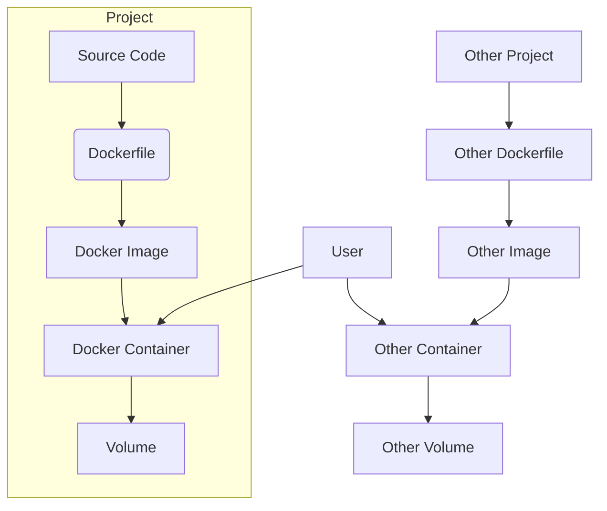

# Docker Setup for qwen-code

This document outlines the Docker setup for the `qwen-code` project. All Docker files are located in the `docker/` directory.

---

## What is Docker?

- **Image**: A snapshot of your application and its environment. Think of it as a blueprint.
- **Container**: A running instance of an image. Like a virtual machine, but lightweight and isolated.
- **Volume**: A persistent storage area for containers. Used to save data outside the container's lifecycle.
- **Dockerfile**: Instructions for building an image.
- **docker-compose.yml**: Defines and runs multi-container Docker applications.

---

## Best Practices & Hierarchy

- Keep all Docker files in a `docker/` directory inside each project for clarity and portability.
- Use project-level Docker setup (not global) so each project is self-contained and reproducible.
- Only use global Docker files for shared infrastructure (rare for app development).

**Recommended Project Structure:**

```
project-root/
  docker/
    Dockerfile
    docker-compose.yml
    .dockerignore
    DOCKER.md
    devcontainer.json (optional)
    Dockerfile.mysql (optional)
    docker-compose.admin.yaml (optional)
    env (optional)
  src/
  scripts/
  ...
```

---

## How Docker Works (Mermaid Diagram)



---

## Quick Reference VS Code Tasks & Commands

### VS Code Tasks

- **Build Docker Environment**: Builds the Docker image
- **Run Docker Container**: Runs the container
- **Build & Run Docker**: Builds and runs the container in one step

### Terminal Commands

```pwsh
# Build the Docker image
docker-compose -f docker/docker-compose.yml build

# Run the container
docker-compose -f docker/docker-compose.yml up

# Build & Run (one step)
docker-compose -f docker/docker-compose.yml up --build

# Run in detached mode
docker-compose -f docker/docker-compose.yml up -d

# Get a shell inside the running container
docker-compose -f docker/docker-compose.yml exec qwen-code /bin/bash

# Build with Docker directly
docker build -f docker/Dockerfile .
```

## Overview

We use Docker to create a consistent and reproducible environment for building and running the `qwen-code` application. The setup consists of the following files in `docker/`:

- `Dockerfile`: Multi-stage build for production and development
- `docker-compose.yml`: Compose file for easy local development
- `.dockerignore`: Excludes unnecessary files from build context

## Prerequisites

- [Docker](https://docs.docker.com/get-docker/)
- [Docker Compose](https://docs.docker.com/compose/install/) (usually included with Docker Desktop)

## Building the Docker Image

To build the Docker image, run:

```pwsh
docker-compose -f docker/docker-compose.yml build
```

## Running the Docker Container

To run the application inside a Docker container:

```pwsh
docker-compose -f docker/docker-compose.yml up
```

To run in detached mode:

```pwsh
docker-compose -f docker/docker-compose.yml up -d
```

To get an interactive shell inside the running container:

```pwsh
docker-compose -f docker/docker-compose.yml exec qwen-code /bin/bash
```

## Dockerfile Explained

The `Dockerfile` uses a multi-stage build approach:

1.  **Builder Stage**:
    - Starts with a `node:20-slim` base image.
    - Installs all necessary dependencies (including `devDependencies`).
    - Copies the entire project source code.
    - Builds the application by running `npm run build`.

2.  **Production Stage**:
    - Starts from a fresh `node:20-slim` base image.
    - Installs only the necessary production packages.
    - Copies the built artifacts from the `builder` stage.
    - Sets up a non-root user for better security.
    - Installs the `qwen-code` CLI globally.
    - Sets the default command to `qwen`.

## Advanced/Optional Files

If you need a database, admin tools, or a devcontainer for VS Code, you can add:

- `docker/Dockerfile.mysql`: For MySQL service
- `docker/docker-compose.admin.yaml`: For admin services
- `docker/devcontainer.json`: For VS Code remote containers
- `docker/env`: For environment variables

## Devcontainer Setup (VS Code)

To use VS Code's Remote Containers:

1. Add a `devcontainer.json` in `docker/`:

```json
{
  "name": "qwen-code-dev",
  "dockerComposeFile": ["docker-compose.yml"],
  "service": "qwen-code",
  "workspaceFolder": "/home/node/app",
  "settings": {},
  "extensions": ["dbaeumer.vscode-eslint", "esbenp.prettier-vscode"]
}
```

2. Open VS Code, run "Remote-Containers: Open Folder in Container".

## Adding More Services

- To add a database, create a new Dockerfile (e.g., `Dockerfile.mysql`) and add a service to `docker-compose.yml`.
- For admin tools, use a separate compose file (e.g., `docker-compose.admin.yaml`).

## Best Practices & Tips

- Keep all Docker files in the `docker/` directory for clarity.
- Use a main `docker-compose.yml` and extend with base or specialized files for modularity.
- Use named volumes for persistent data (see example in `docker-compose.yml`).
- Update paths in compose files and documentation if you move files.
- Use `.dockerignore` to keep builds fast and clean.
- For faster launches, use detached mode (`up -d`) and pre-build images with `docker-compose build`.
- The Docker whale 🐳 in the UI means Docker is running! If you see it, you're good to go.
- Use VS Code tasks for one-click build/run.
- Use `docker-compose logs` to debug container output.
- Clean up unused containers/images with `docker system prune`.

## Troubleshooting

- If you see vulnerabilities, consider updating your base image or scanning with tools like `docker scan`.
- For multi-stage builds, always set the correct build context and Dockerfile path.

## Future Projects

- Use this structure for all new projects for consistency.
- Add devcontainer support if you want VS Code integration.
